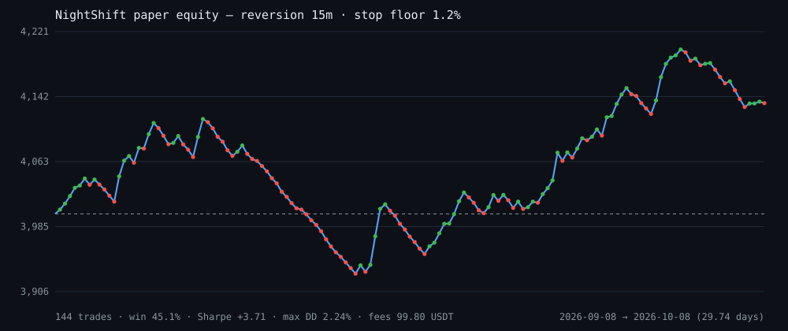
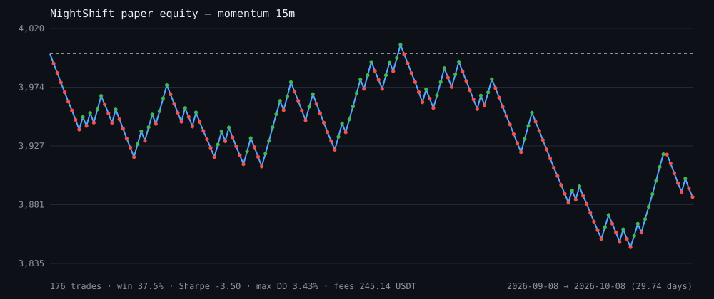

# Paper trading log — method, results, and what it does *not* prove

This directory holds the validation material for the **Agentic Trading** track:
walk-forward paper trading runs against real Bitget candles, produced by
`python -m nightshift.cli paper` and `python -m scripts.grid`.

Every number below is reproducible from the JSON files next to this file.

---

## Method (and why each choice matters)

| Choice | Reason |
|---|---|
| **Walk-forward, no lookahead** | The decision at bar *i* sees `candles[i+1-window : i+1]` only, and the fill happens at the **open of bar i+1** — when a market order sent at bar *i*'s close would actually trade. A test asserts the fill is never the signal bar's close. |
| **Stop checked before target inside a bar** | When one bar contains both levels, the pessimistic ordering is used. The optimistic ordering is the most common way a simulator flatters its author. |
| **Fees charged on both legs** | Bitget USDT-M **taker 0.06% per side**. Strategies that only work fee-free do not work. |
| **One position at a time, per symbol** | Matches the live agent's `--max-positions 1`; trades cannot overlap or pyramid. |
| **Time stop** | A position that neither hits its stop nor its target is closed after `--max-hold` bars (default 96), so a dead trade cannot sit forever. |
| **Refusals recorded** | Every trade the risk layer rejected is counted and logged with its reason. A rail that never fires is decoration. |

## Data

| | 15m run | 1H run |
|---|---|---|
| Universe | XAUUSDT, BTCUSDT, ETHUSDT, SOLUSDT | same |
| Bars per symbol | 2 976 | 1 000 |
| Window | 2026-09-07 16:30 → 2026-10-07 10:15 UTC | 2026-08-31 → 2026-10-07 |
| Span | **29.74 days** | **36.62 days** |

Both windows exceed the handbook's "recommended ≥ 2 weeks" and were produced
during the competition period.

## Aggregate results

| Config | Trades | Win rate | Sharpe | Sortino | Max DD | Expectancy | Profit factor | Total return | Fees paid |
|---|---|---|---|---|---|---|---|---|---|
| **15m · reversion · stop ≥ 1.2%** | 144 | 45.14% | **+3.71** | +5.29 | **2.24%** | **+0.933** USDT | 1.241 | **+3.36%** | 99.80 USDT |
| 15m · momentum (no stop floor) | 176 | 37.50% | −3.50 | −6.57 | 3.43% | −0.640 USDT | 0.857 | −3.89% | **245.14 USDT** |
| 1H · reversion · stop ≥ 1.2% | 89 | 35.96% | −0.67 | −0.96 | 2.26% | −0.241 USDT | 0.949 | −0.54% | 55.27 USDT |

Per-symbol Sharpe for the winning configuration:

| Symbol | Trades | Sharpe |
|---|---|---|
| XAUUSDT | 16 | −0.30 |
| BTCUSDT | 34 | −0.21 |
| ETHUSDT | 39 | +3.35 |
| SOLUSDT | 52 | +2.69 |

### Equity curves





Regenerate either with `python -m scripts.chart <log.json> <out.svg>` — the chart
is built from the trade log by stdlib string assembly, so two runs can be diffed.

Read that honestly: **the edge is concentrated in SOL and ETH**, XAU loses, and
a 30-day window is one regime. This is evidence, not proof.

## The finding that made the difference

The first grid run was negative in **every** configuration — momentum at 15m
lost money with a Sharpe worse than −20 on the training half. The cause was not
prediction, it was arithmetic:

```
fees per round trip = notional × fee_rate × 2
risk per trade      = size × stop_distance
hence:  fees / risk = (entry × 2 × fee_rate) / stop_distance      ← size cancels
```

The ratio does not depend on position size at all, only on how wide the stop is
relative to price. With a 0.06% taker fee:

| Stop distance | Fees as a share of the risk budget |
|---|---|
| 0.12% (a 15m ATR-ish stop) | **100%** — every trade must win twice to break even |
| 0.40% | 30% |
| 1.20% | 10% |

A 15m reversal stop is roughly 0.1–0.3% of price, so the strategy was paying its
entire risk budget in fees, twice over. Two rails were added in response, and
both are in `risk.py`:

1. **`min_stop_pct`** — widen a too-tight stop to a floor (the tuned run uses
   1.2%), which also shrinks position size to keep the risk constant.
2. **`max_fee_ratio`** — refuse the trade outright when fees would still exceed
   that share of the risk (default 30%). The momentum baseline produced **744
   such refusals**, and paid **245.14 USDT in fees on 176 trades** — a bill
   larger than the entire pooled paper capital of any single symbol account.
   That is the rail doing its job, and the reason the tuned run's fee bill is
   99.80 USDT on 144 trades instead.

## Train / validation grid

`grid.json` holds 12 configurations, each run on the first 70% of the bars
("train") and the last 30% ("validation"), with the full table reported either
way. Exactly one configuration was positive on **both** halves:

| tf | engine | stop floor | train (n / sharpe / exp) | validation (n / sharpe / exp) |
|---|---|---|---|---|
| 15m | reversion | 1.2% | 105 / **+2.02** / +0.496 | 31 / **+6.24** / +1.644 |

Everything else was negative in training, in validation, or both. The headline
configuration was selected on the training half; the validation half is
genuinely out-of-sample for that choice.

## Conventions stated plainly

- **Equity:** each symbol runs its own **$1 000** paper account at **1% risk per
  trade**, 50x leverage cap, isolated margin model.
- **Pooled panel:** the aggregate treats the four symbols as four accounts, so
  pooled starting capital is **$4 000** and pooled returns are computed against
  it. This is why the aggregate Sharpe (+4.17) is lower than ETH's standalone
  (+3.69 → pooled contribution diluted by XAU's loss) — a smaller number on a
  bigger, honest denominator.
- **Sharpe:** annualised from **per-trade** returns using the run's own trade
  frequency (trades/day × 365), risk-free rate 0. The `periodsPerYear` field is
  written into every log so the convention travels with the number.
- **Fees:** taker 0.06% per side. The **maker** rate (0.02%) is not modelled —
  it would improve every row, and it is the first thing a live deployment would
  target (limit entries).

## Configuration search — 48 cells, train vs validation

`search.json` holds a wider sweep: 2 timeframes × 4 engines × 3 stop floors × 2
efficiency-ratio floors, each run on the first 70% of the bars (train) and the
last 30% (validation). **6 of 48 cells were positive on both halves.**

| # | Config | Train (n / Sharpe / exp / maxDD) | Validation (n / Sharpe / exp / maxDD) |
|---|---|---|---|
| 1 | **1H exhaustion, stop ≥ 1.2%, ER ≥ 0** | 68 / **+4.89** / +2.54 / 1.75% | 13 / **+6.69** / +2.10 / 0.62% |
| 2 | 15m exhaustion, no stop floor, ER ≥ 0.1 | 51 / +4.21 / +1.65 / 1.36% | 7 / +3.00 / +1.62 / 0.30% |
| 3 | **15m reversion, stop ≥ 1.2%, ER ≥ 0.1** | **107** / +2.82 / +0.69 / 2.26% | **34** / +5.25 / +1.31 / 0.97% |
| 4 | 15m exhaustion, no stop floor, ER ≥ 0 | 55 / +3.84 / +1.50 / 1.97% | 8 / +1.84 / +0.88 / 0.40% |
| 5 | 15m reversion, stop ≥ 1.2%, ER ≥ 0 | 108 / +1.79 / +0.44 / 2.41% | 34 / +5.25 / +1.31 / 0.97% |
| 6 | 15m exhaustion, stop ≥ 1.2%, ER ≥ 0 | **99** / +0.62 / +0.12 / 2.40% | 27 / **+7.24** / +1.47 / 0.66% |

Three things are worth reading out of that table:

- **The exhaustion engine appears in four of the six survivors**, and a wide
  stop floor in the highest-Sharpe cells. That coherence is more informative
  than any single cell: it is the same mechanism as the fee finding above —
  fading a spike with a wide stop pays; chasing a trend with a tight stop does
  not.
- **Cell #3 carries the most evidence** (107 train trades, 34 validation,
  positive on both, and the validation half *better* than training: Sharpe
  +2.82 → +5.25). Cell #1 has the best worst-half Sharpe but only 13 validation
  trades — and its 1H holds are exposed to the funding cost this simulator does
  not model. That is why the shipped default stays on 15m reversion: the most
  evidence and the least unmodelled cost, not the prettiest Sharpe.
- **A 6-in-48 hit rate is partly what multiple testing produces.** At this
  sample size one or two false positives should be expected; the survivors are
  candidates, not conclusions.

## Bug found and fixed in this simulator

The first version of these logs reported Sharpe **+13 to +17** on cheap coins
(DOGE, ALGO, HBAR) with a 69–75% win rate and a **positive** average PnL on
"stop" exits — which is impossible: a stop-loss exit has to lose.

Cause: the simulator left `price_place` at its default of **2 decimal places**.
At DOGE 0.088 that rounds the stop to 0.09 — *above* the entry — and the target
to 0.09, *below* it. The exit walk then reported a stop hit at a price better
than entry, manufacturing winners out of stop-outs. At XAU 4 130 the same
rounding is 0.0002% of price and harmless, which is why the majors' results
barely moved.

Fix: `build_plan(..., price_place=None)` inside simulations keeps full
precision; the venue's tick size is applied only when sending a real order. A
regression test now asserts that **every stop exit has negative gross PnL and
every target exit positive**, and the corrected cheap-coin run is negative
(aggregate Sharpe −0.47), so that "edge" was an artefact and is reported as
one. The lesson generalises: a backtest that never checks its own exit
accounting is describing a market that does not exist.

## What this does *not* prove

- **30 days is one regime.** These are range/trend-down conditions, not a
  year-long sample.
- **No funding costs, no slippage, no partial fills.** A live run on thin
  symbols will do worse than this simulation, not better.
- **Config selection happened after seeing the grid.** The validation half
  mitigates but does not eliminate that bias; a third, untouched window would be
  the honest next step.
- **Edge concentrated in two of four symbols.** XAU lost money in the winning
  configuration; the per-symbol table is included so that is visible.

## Reproduce

```bash
export BITGET_API_KEY=... BITGET_API_SECRET=... BITGET_API_PASSPHRASE=...

# headline run
python -m nightshift.cli --symbols XAUUSDT,BTCUSDT,ETHUSDT,SOLUSDT \
    --engine reversion --min-stop-pct 1.2 \
    paper --timeframe 15m --pages 6 --out docs/paper/paper_15m_reversion.json

# fee-blind baseline (shows what the fee rail has to refuse, and what it costs)
python -m nightshift.cli --symbols XAUUSDT,BTCUSDT,ETHUSDT,SOLUSDT \
    --engine momentum paper --timeframe 15m --pages 6 \
    --out docs/paper/paper_15m_momentum_baseline.json

# train / validation grid
python -m scripts.grid --pages 6 --out docs/paper/grid.json

# reconcile full-window vs split runs
python -m scripts.diagnose_split --engine reversion --min-stop-pct 1.2
```

All of it is read-only against the exchange: `paper` never sends an order.
